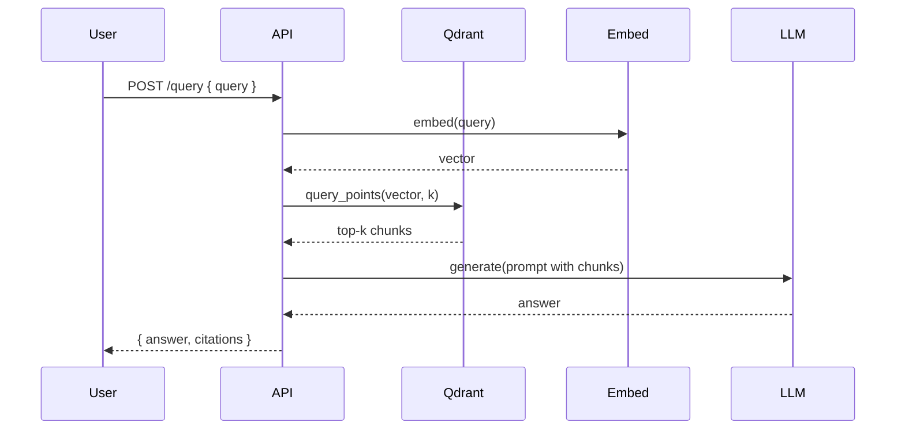

Mermaid diagrams placeholder. Add `.mmd` sources here.

```mermaid
 flowchart LR
	 A[User] -->|HTTP /query| B(FastAPI API)
	 B --> C[Retriever (Qdrant)]
	 B --> D[Embedder (Sentence-Transformers)]
	 C --> B
	 D --> B
	 B --> E[LLM (HF provider)]
	 E --> B
	 B -->|Answer + Citations| A
```



Mermaid diagrams placeholder. Add `.mmd` sources here.
